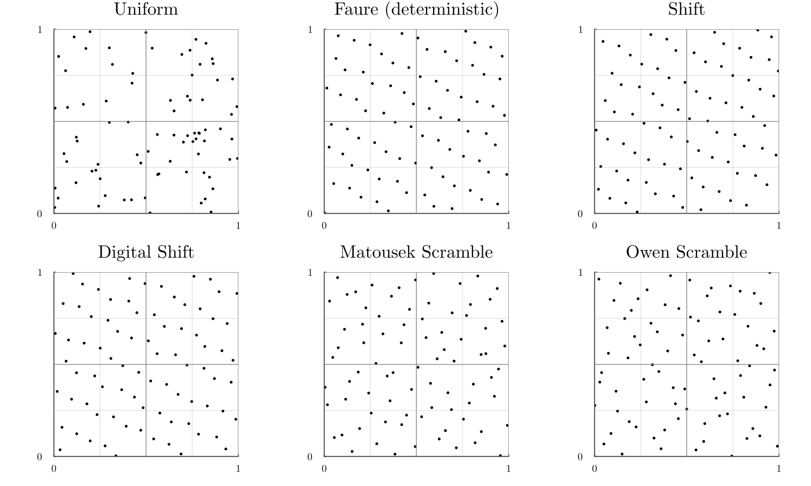

# QuasiMonteCarlo.jl

[](https://julialang.zulipchat.com/#narrow/stream/279055-sciml-bridged)
[](https://docs.sciml.ai/QuasiMonteCarlo/stable/)

[](https://codecov.io/gh/SciML/QuasiMonteCarlo.jl)
[](https://github.com/SciML/QuasiMonteCarlo.jl/actions?query=workflow%3ACI)

[](https://github.com/SciML/ColPrac)
[](https://github.com/SciML/SciMLStyle)

This is a lightweight package for generating Quasi-Monte Carlo (QMC) samples
using various different methods.

## Tutorials and Documentation

For information on using the package,
[see the stable documentation](https://docs.sciml.ai/QuasiMonteCarlo/stable/). Use the
[in-development documentation](https://docs.sciml.ai/QuasiMonteCarlo/dev/) for the version of
the documentation, which contains the unreleased features.

## Example

```julia
using QuasiMonteCarlo, Distributions
lb = [0.1,-0.5]
ub = [1.0,20.0]
n = 5
d = 2

s = QuasiMonteCarlo.sample(n,lb,ub,GridSample([0.1,0.5]))
s = QuasiMonteCarlo.sample(n,lb,ub,UniformSample())
s = QuasiMonteCarlo.sample(n,lb,ub,SobolSample())
s = QuasiMonteCarlo.sample(n,lb,ub,LatinHypercubeSample())
s = QuasiMonteCarlo.sample(n,lb,ub,LatticeRuleSample())
s = QuasiMonteCarlo.sample(n,lb,ub,HaltonSample([10,3], false))
```

The output `s` is a matrix, so one can use things like `@uview` from
[UnsafeArrays.jl](https://github.com/oschulz/UnsafeArrays.jl) for a stack-allocated
view of the `i`th point:

```julia
using UnsafeArrays
@uview s[:,i]
```

## API

Everything has the same interface:

```julia
A = QuasiMonteCarlo.sample(n,lb,ub,sample_method)
```

where:

- `n` is the number of points to sample.
- `lb` is the lower bound for each variable. The length determines the dimensionality.
- `ub` is the upper bound.
- `sample_method` is the quasi-Monte Carlo sampling strategy.

Additionally, there is a helper function for generating design matrices:

```julia
k=2
As = QuasiMonteCarlo.generate_design_matrices(n,lb,ub,sample_method,k)
```

which returns `As` which is an array of `k` design matrices `A[i]` that are
all sampled from the same low-discrepancy sequence.

## Available Sampling Methods

Sampling methods `SamplingAlgorithm` are divided into two subtypes

- `DeterministicSamplingAlgorithm`
  - `GridSample(dx)` where the grid is given by `lb:dx[i]:ub` in the ith direction.
  - `SobolSample` for the Sobol' sequence.
  - `FaureSample` for the Faure sequence.
  - `LatticeRuleSample` for a randomly-shifted rank-1 lattice rule.
  - `HaltonSample(base)` where `base[i]` is the base in the ith direction.
  - `GoldenSample` for a Golden Ratio sequence.
  - `KroneckerSample(alpha, s0)` for a Kronecker sequence, where alpha is an length-`d` vector of irrational numbers (often `sqrt(d`)) and `s0` is a length-`d` seed vector (often `0`).
- `RandomSamplingAlgorithm`
  - `UniformSample` for uniformly distributed random numbers.
  - `LatinHypercubeSample` for a Latin Hypercube.
  - Additionally, any `Distribution` can be used, and it will be sampled from.
  <!-- - `SectionSample(x0, sampler)` where `sampler` is any sampler above and `x0` is a vector of either `NaN` for a free dimension or some scalar for a constrained dimension. Not currently supported. -->

## Adding a new sampling method

Adding a new sampling method is a two-step process:

1. Add a new SamplingAlgorithm type.
2. Overload the sample function with the new type.

All sampling methods are expected to return a matrix with dimension `d` by `n`, where `d` is the dimension of the sample space and `n` is the number of samples.

**Example**

```julia
struct NewAmazingSamplingAlgorithm{OPTIONAL} <: SamplingAlgorithm end

function sample(n,lb,ub,::NewAmazingSamplingAlgorithm)
    if lb isa Number
        ...
        return x
    else
        ...
        return reduce(hcat, x)
    end
end
```

## Randomization of QMC sequences

Most of the previous methods are deterministic i.e. `sample(n, d, Sampler()::DeterministicSamplingAlgorithm)` always produces the same sequence $X = (X_1, \dots, X_n)$.
A randomized QMC method must

1. Preserve the QMC (low discrepancy) properties of $X$.
2. Have $X_i\sim \mathbb{U}([0,1]^d)$ for each $i\in \{1,\cdots, n\}$.

This randomized version can be used to obtain confidence interval or sensitivity analysis for example.

In this package, given a sample matrix `X` of size $d\times n$ randomized version are obtained using the function `randomize(x, ::RandomizationMethod)` where the following methods have been implemented:

- Scrambling methods `ScramblingMethods(base, pad, rng)` are well suited for $(t,m,d)$-nets. `base` is the base used to scramble and `pad` the number of bits in `b`-ary decomposition i.e. $y \simeq \sum_{k=1}^{\texttt{pad}} y_k/\texttt{base}^k $.
`pad` is generally chosen as $\gtrsim \log_b(n)$.
The implemented `ScramblingMethods` are
  - `DigitalShift` the simplest and faster method. For a point $x\in [0,1]^d$ it does $y_k = (x_k + U_k) \mod b$ where $U_k ∼ \mathbb{U}(\{0, \cdots, b-1\})$
  - `MatousekScramble` a.k.a Linear Matrix Scramble is what people use in practice. Indeed, the observed performances are similar to `OwenScramble` for a lesser numerical cost.
  - `OwenScramble` a.k.a Nested Uniform Scramble is the most understood theoretically but is more costly to operate.
- `Shift(rng)` a.k.a. Cranley Patterson Rotation. It is by far the fastest method, it is used in `LatticeRuleScramble` for example.

All these randomization methods guarantee that the resulting array will have its components uniformly distributed (but not independent).

For numerous independent randomization, use `generate_design_matrices(n, d, ::DeterministicSamplingAlgorithm), ::RandomizationMethod, num_mats)` where `num_mats` is the number of independent `X` generated.

### Example

Randomization of a Faure sequence with various methods.

```julia
    using QuasiMonteCarlo
    m = 4
    d = 3
    b = QuasiMonteCarlo.nextprime(d)
    N = b^m # Number of points
    pad = m # Can also choose something as `2m` to get "better" randomization

    # Unrandomized low discrepency sequence
    x_faure = QuasiMonteCarlo.sample(N, d, FaureSample())

    # Randomized version
    x_nus = randomize(x_faure, OwenScramble(base = b, pad = pad))
    x_lms = randomize(x_faure, MatousekScramble(base = b, pad = pad))
    x_digital_shift = randomize(x_faure, DigitalShift(base = b, pad = pad))
    x_shift = randomize(x_faure, Shift())
    x_uniform = rand(d, N) # plain i.i.d. uniform
```

```julia
using Plots
# Setting I like for plotting
default(fontfamily="Computer Modern", linewidth=1, label=nothing, grid=true, framestyle=:default)
```

Plot the resulting sequences along dimensions `1` and `3`.

```julia
    d1 = 1
    d2 = 3 # you can try every combination of dimension (d1, d2)
    sequences = [x_uniform, x_faure, x_shift, x_digital_shift, x_lms, x_nus]
    names = ["Uniform", "Faure (deterministic)", "Shift", "Digital Shift", "Matousek Scramble", "Owen Scramble"]
    p = [plot(thickness_scaling=1.5, aspect_ratio=:equal) for i in sequences]
    for (i, x) in enumerate(sequences)
        scatter!(p[i], x[d1, :], x[d2, :], ms=0.9, c=1, grid=false)
        title!(names[i])
        xlims!(p[i], (0, 1))
        ylims!(p[i], (0, 1))
        yticks!(p[i], [0, 1])
        xticks!(p[i], [0, 1])
        hline!(p[i], range(0, 1, step=1 / 4), c=:gray, alpha=0.2)
        vline!(p[i], range(0, 1, step=1 / 4), c=:gray, alpha=0.2)
        hline!(p[i], range(0, 1, step=1 / 2), c=:gray, alpha=0.8)
        vline!(p[i], range(0, 1, step=1 / 2), c=:gray, alpha=0.8)
    end
    plot(p..., size=(1500, 900))
```



Faure nets and scrambled versions of Faure nets are digital $(t,m,d)$-net ([see this nice book by A. Owen](https://artowen.su.domains/mc/qmcstuff.pdf)). It basically means that they have strong equipartition properties.
Here we can (visually) verify that with Nested Uniform Scrambling (it also works with Linear Matrix Scrambling and Digital Shift).
You must see one point per rectangle of volume $1/b^m$. Points on the "left" border of rectangles are included while those on the "right" are excluded.

```julia
begin
    d1 = 1 
    d2 = 3 # you can try every combination of dimension (d1, d2)
    x = x_nus # Owen Scramble, you can try x_lms and x_digital_shift
    p = [plot(thickness_scaling=1.5, aspect_ratio=:equal) for i in 0:m]
    for i in 0:m
        j = m - i
        xᵢ = range(0, 1, step=1 / b^(i))
        xⱼ = range(0, 1, step=1 / b^(j))
        scatter!(p[i+1], x[d1, :], x[d2, :], ms=2, c=1, grid=false)
        xlims!(p[i+1], (0, 1.01))
        ylims!(p[i+1], (0, 1.01))
        yticks!(p[i+1], [0, 1])
        xticks!(p[i+1], [0, 1])
        hline!(p[i+1], xᵢ, c=:gray, alpha=0.2)
        vline!(p[i+1], xⱼ, c=:gray, alpha=0.2)
    end
    plot(p..., size=(1500, 900))
end
```


