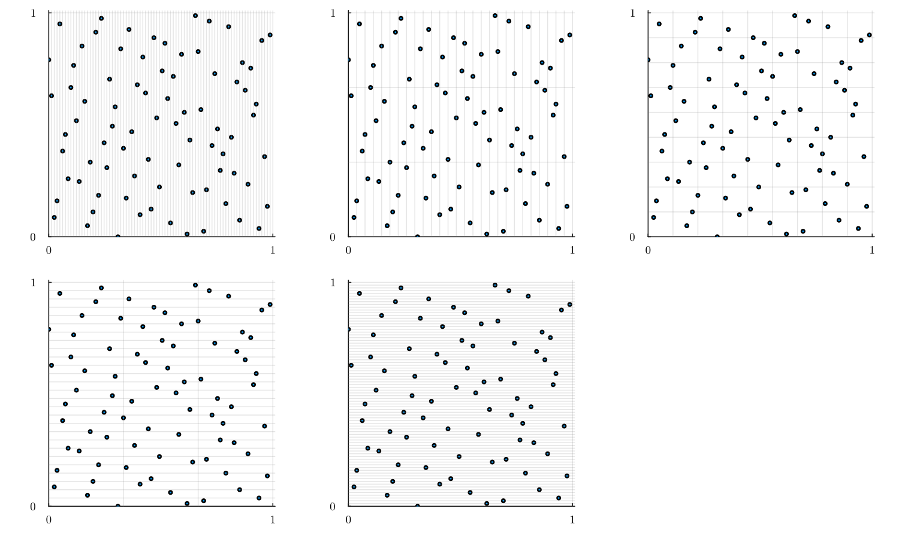

# Randomization methods

Most of the methods presented in [sampler.jl Samplers](@ref) are deterministic i.e. `sample(n, d, Sampler()::DeterministicSamplingAlgorithm)` always produces the same sequence $X = (X_1, \dots, X_n)$.

The main issue with deterministic Quasi Monte Carlo sampling is that it does not allow easy error estimation as opposed to plain Monte Carlo where the variance can be estimated.

A Randomized Quasi Monte Carlo method must respect the two following criteria

1. Have $X_i\sim \mathbb{U}([0,1]^d)$ for each $i\in \{1,\cdots, n\}$.
2. Preserve the QMC (low discrepancy) properties of $X$.

This randomized version can be used to obtain confidence interval or sensitivity analysis for example.

## API

To randomize one can directly use a sampling algorithm with a randomization method as `sample(n, d, DeterministicSamplingAlgorim(R = RandomizationMethod()))` or `sample(n, lb, up, DeterministicSamplingAlgorim(R = RandomizationMethod()))`.

Randomization methods can also be used independently, that is, given a matrix $X$ ($d\times n$) of $n$ points in dimension $d$ in $[0,1]^d$ one can directly randomize it using `randomize(x, ::RandomizationMethod())`
```@docs
randomize
```

## Scrambling methods 

`ScramblingMethods(base, pad, rng)` are well suited for $(t,m,d)$-nets. `base` is the base used to scramble and `pad` the number of bits in `b`-ary decomposition i.e. $y \simeq \sum_{k=1}^{\texttt{pad}} y_k/\texttt{base}^k $.
`pad` is generally chosen as $\gtrsim \log_b(n)$.
The implemented `ScramblingMethods` are
  - `DigitalShift` the simplest and faster method. For a point $x\in [0,1]^d$ it does $y_k = (x_k + U_k) \mod b$ where $U_k ∼ \mathbb{U}(\{0, \cdots, b-1\})$
  ```@docs
  DigitalShift
  ```
  - `MatousekScramble` a.k.a Linear Matrix Scramble is what people use in practice. Indeed, the observed performances are similar to `OwenScramble` for a lesser numerical cost.
    ```@docs
    MatousekScramble
    ```
  - `OwenScramble` a.k.a Nested Uniform Scramble is the most understood theoretically but is more costly to operate.
    ```@docs
    OwenScramble
    ```
    s
## Other methods

`Shift(rng)` a.k.a. Cranley Patterson Rotation. It is by far the fastest method, it is used in `LatticeRuleScramble` for example.
```@docs
  Shift
```

## Design Matrices

For numerous independent randomization, use `generate_design_matrices(n, d, ::DeterministicSamplingAlgorithm), ::RandomizationMethod, num_mats)` where `num_mats` is the number of independent `X` generated.
```@docs
  generate_design_matrices
```

## Example

Randomization of a Faure sequence with various methods.

```julia
using QuasiMonteCarlo
m = 4
d = 3
b = QuasiMonteCarlo.nextprime(d)
N = b^m # Number of points
pad = m # Can also choose something as `2m` to get "better" randomization

# Unrandomized low discrepency sequence
x_faure = QuasiMonteCarlo.sample(N, d, FaureSample())

# Randomized version
x_nus = randomize(x_faure, OwenScramble(base = b, pad = pad)) # equivalent to sample(N, d, FaureSample(R = OwenScramble(base = b, pad = pad)))
x_lms = randomize(x_faure, MatousekScramble(base = b, pad = pad))
x_digital_shift = randomize(x_faure, DigitalShift(base = b, pad = pad))
x_shift = randomize(x_faure, Shift())
x_uniform = rand(d, N) # plain i.i.d. uniform
```

```julia
using Plots
# Setting I like for plotting
default(fontfamily="Computer Modern", linewidth=1, label=nothing, grid=true, framestyle=:default)
```

Plot the resulting sequences along dimensions `1` and `3`.

```julia
d1 = 1
d2 = 3 # you can try every combination of dimension (d1, d2)
sequences = [x_uniform, x_faure, x_shift, x_digital_shift, x_lms, x_nus]
names = ["Uniform", "Faure (deterministic)", "Shift", "Digital Shift", "Matousek Scramble", "Owen Scramble"]
p = [plot(thickness_scaling=1.5, aspect_ratio=:equal) for i in sequences]
for (i, x) in enumerate(sequences)
    scatter!(p[i], x[d1, :], x[d2, :], ms=0.9, c=1, grid=false)
    title!(names[i])
    xlims!(p[i], (0, 1))
    ylims!(p[i], (0, 1))
    yticks!(p[i], [0, 1])
    xticks!(p[i], [0, 1])
    hline!(p[i], range(0, 1, step=1 / 4), c=:gray, alpha=0.2)
    vline!(p[i], range(0, 1, step=1 / 4), c=:gray, alpha=0.2)
    hline!(p[i], range(0, 1, step=1 / 2), c=:gray, alpha=0.8)
    vline!(p[i], range(0, 1, step=1 / 2), c=:gray, alpha=0.8)
end
plot(p..., size=(1500, 900))
```


Faure nets and scrambled versions of Faure nets are digital $(t,m,d)$-net ([see this nice book by A. Owen](https://artowen.su.domains/mc/qmcstuff.pdf)). It basically means that they have strong equipartition properties.
Here we can (visually) verify that with Nested Uniform Scrambling (it also works with Linear Matrix Scrambling and Digital Shift).
You must see one point per rectangle of volume $1/b^m$. Points on the "left" border of rectangles are included while those on the "right" are excluded.

```julia
begin
    d1 = 1 
    d2 = 3 # you can try every combination of dimension (d1, d2)
    x = x_nus # Owen Scramble, you can try x_lms and x_digital_shift
    p = [plot(thickness_scaling=1.5, aspect_ratio=:equal) for i in 0:m]
    for i in 0:m
        j = m - i
        xᵢ = range(0, 1, step=1 / b^(i))
        xⱼ = range(0, 1, step=1 / b^(j))
        scatter!(p[i+1], x[d1, :], x[d2, :], ms=2, c=1, grid=false)
        xlims!(p[i+1], (0, 1.01))
        ylims!(p[i+1], (0, 1.01))
        yticks!(p[i+1], [0, 1])
        xticks!(p[i+1], [0, 1])
        hline!(p[i+1], xᵢ, c=:gray, alpha=0.2)
        vline!(p[i+1], xⱼ, c=:gray, alpha=0.2)
    end
    plot(p..., size=(1500, 900))
end
```


